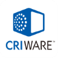

[English](README.md) / [日本語](README.ja.md)

---

# Live2D Cubism MotionSync Core

このフォルダーには、モーションシンクを利用したネイティブアプリケーションを開発するためのヘッダーおよびプラットフォーム固有のライブラリファイルが含まれています。

## Library List

| プラットフォーム | アーキテクチャ | dll | lib | パス | 注記 |
| --- | --- | --- | --- | --- | --- |
| Android | ARM64 | ✓ |   | CRI/dll/Android/arm64-v8a |   |
| Android | x86 | ✓ |   | CRI/dll/Android/x86 |   |
| Android | x86_64 | ✓ |   | CRI/dll/Android/x86_64 |   |
| iOS | ARM64 |   | ✓ | CRI/lib/iOS/Release-iphoneos | iOS Devices |
| iOS | ARM64 |   | ✓ | CRI/lib/iOS/Release-iphonesimulator | iOS Simulator |
| iOS | x86_64 |   | ✓ | CRI/lib/iOS/Release-iphonesimulator | iOS Simulator |
| macOS | ARM64 | ✓ |   | CRI/dll/macOS |   |
| macOS | x86_64 | ✓ |   | CRI/dll/macOS |   |
| Windows | x86 | ✓ |   | CRI/dll/Windows/x86 |   |
| Windows | x86_64 | ✓ |   | CRI/dll/Windows/x86_64 |   |

### 呼び出し規約

*Windows/x86*のダイナミックリンクライブラリを使用する場合は、呼び出し規約として明示的に`__stdcall`を使用してください。

---

このソフトウェアには、（株）ＣＲＩ・ミドルウェアの「CRIWARE (R)」が使用されています。
